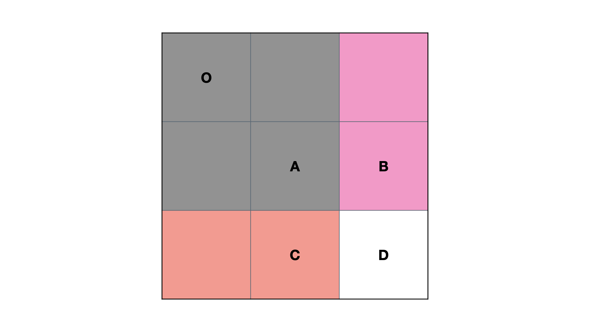

### 数据结构与算法
有句老话是程序就是数据结构与算法，即使是操作系统这样复杂的程序。<br>
数据结构是算法的前提，以leetcode之类的刷题网站来说，考察的算法较为朴素，更多的是考察数据结构的运用。而学好数据结构，在日常工作中解决一些棘手问题，往往能起到事半功倍的效果。<br>
除了教材中学到的链表、树、图、哈希、堆栈之类的常见数据结构外，有些高阶的数据结构也值得学习，其设计堪称诡谲、其用途堪称巧妙。
<br>


### 前缀树

前缀树(Trie)又称字典树，是一种树形数据结构，用于高效地存储和检索字符串数据集中的键。这一数据结构有相当多的应用情景，例如自动补完和拼写检查。使用过solr或者es等倒排索引工具的开发者应该对此比较敏感。[208. 实现 Trie (前缀树)](https://leetcode-cn.com/problems/implement-trie-prefix-tree/) 即是前缀树的设计题目。<br>
前缀树本质是一种树，不过这种树比较特殊，以英文小写字串为例，每个节点有26个子节点，同时每个节点除了存储字母外,附带一个是否结束的标识，如果结束则说明能搜索到结果，否则仅仅是前缀。原理简单，检索的复杂度也极低(O(n))，大道至简。
<br>
首先是初始化:
```
    private final Trie[] children;
    private boolean isEnd;

    public Trie() {
        children = new Trie[26];
        isEnd = false;
    }
```
<br>
接着是插入，这里比较巧妙的一点是利用char -'a'获取下标，实现按下标取值:

```
    private final Trie[] children;
    private boolean isEnd;

    public Trie() {
        children = new Trie[26];
        isEnd = false;
    }
```

<br>
然后就是检索，这里只列举核心的前缀检索，实际结果判断下是否结束即可实现全词匹配搜索和前缀搜索的功能:

```
    private Trie searchPrefix(String prefix) {
        Trie node = this;
        for (int i = 0; i < prefix.length(); i++) {
            char ch = prefix.charAt(i);
            int index = ch - 'a';
            if (node.children[index] == null) {
                return null;
            }
            node = node.children[index];
        }
        return node;
    }

```

### 前缀和
前缀和是典型的原理粗暴却效率很高的数据结构与算法。前缀和分两种：一维前缀和和多维前缀和。[303. 区域和检索 - 数组不可变](https://leetcode-cn.com/problems/range-sum-query-immutable/) 是一维前缀和的题目。一维前缀和的原理非常简单,类似差分：比如求一个数组第三条到第六条之间的数据和，只需要把前6条相加的和，减去前2条相加的和，即可。具体操作上，O(n)的复杂度，记录每一项的前缀和，然后一劳永逸，直接下标相减即可得到区间和：
```

//初始化前缀和数组
    public NumArray(int[] nums) {
        int len = nums.length;
        ps = new int[len + 1];

        for (int i = 0; i < len; i++) {
            ps[i + 1] = ps[i] + nums[i];
        }

    }

//相减得到前缀和
    public int sumRange(int i, int j) {
        return ps[j + 1] - ps[i];
    }

```

二维前缀和理解起来要费劲很多，原理可以用下图表示:

<br>
S(O,D)=S(O,C)+S(O,B)−S(O,A)+D
<br>
减去 S(O, A)S(O,A) 的原因是 S(O, C)S(O,C) 和 S(O, B)S(O,B) 中都有 S(O, A)S(O,A)，即加了两次 S(O, A)S(O,A)，所以需要减去一次 S(O, A)S(O,A)。
<br>

[304. 二维区域和检索 - 矩阵不可变](https://leetcode-cn.com/problems/range-sum-query-2d-immutable/) 是二维前缀和的题目。实际上这个题目也可以用一维前缀和解决，将每一行的区间和相加即可，不过这种O(n)的复杂度与前缀和要实现的O(1)的复杂度相悖。故应当用二维解决：

```
//初始化前缀和数组
public NumMatrix304(int[][] matrix) {
        int height = matrix.length, width = matrix[0].length;
        prex = new int[height + 1][width + 1];
        for (int i = 0; i < height; i++) {
            for (int j = 0; j < width; j++) {
                prex[i + 1][j + 1] = prex[i][j + 1] + prex[i + 1][j] - prex[i][j] + matrix[i][j];//多加了一次重叠的区域，剪掉
            }
        }

    }

//相减得到前缀和
    public int sumRegion(int row1, int col1, int row2, int col2) {
        return prex[row2 + 1][col2 + 1] - prex[row1][col2 + 1] - prex[row2 + 1][col1] + prex[row1][col1];//多减了一次重叠的区域，加回来
    }

```
[363. 矩形区域不超过 K 的最大数值和](https://leetcode-cn.com/problems/max-sum-of-rectangle-no-larger-than-k/) 是二维前缀和的应用题。可以在304的基础上嵌套2次循环，暴力解决：
```
 int[][] pres;

    public int maxSumSubmatrix(int[][] matrix, int k) {

        int height = matrix.length,width = matrix[0].length;
        pres = new int[height+1][width+1];
        for(int i=0;i<height;++i){
            for(int j=0;j<width;++j){
                pres[i+1][j+1] = pres[i][j+1] + pres[i+1][j] - pres[i][j] + matrix[i][j];
            }
        }
        int max = Integer.MIN_VALUE;
        int temp;
        for(int i=0;i<height;++i){
            for(int j=0;j<width;++j){
                for(int m=0;m<=i;++m){
                    for(int n=0;n<=j;++n){
                        temp = pres[i+1][j+1] - pres[i+1][n] - pres[m][j+1] + pres[m][n];
                        if(temp <=k)
                            max = Math.max(max,temp);
                    }
                }
            }
        }
        return max;
    }

```